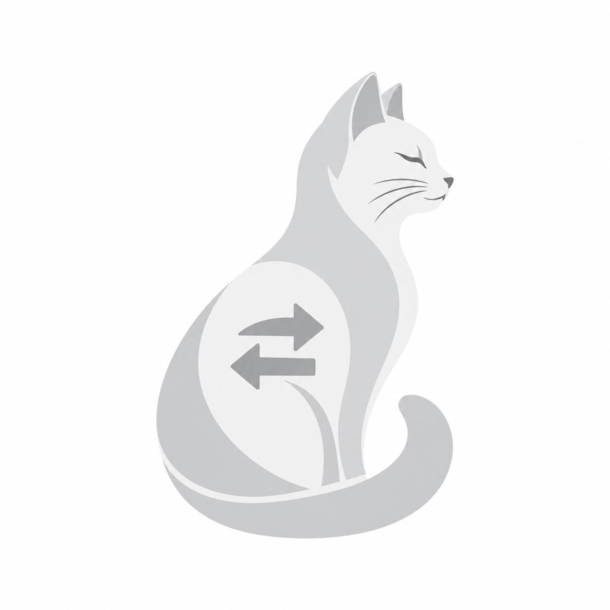

<p align="center">
  
</p>

# Shoev Switcher

Нативный автоматический переключатель русской и английской раскладок для macOS.

Shoev Switcher работает локально, живёт в строке меню и не использует Electron, WebView, облачные API или телеметрию. Приложение исправляет уверенно распознанные слова после пробела или знака препинания. Двойное нажатие правого Shift принудительно конвертирует текущее или последнее слово.

> Проект находится на ранней стадии (`0.1.0`). Перед публичным релизом нужны полевые тесты совместимости и настройка Developer ID.

## Возможности

- автоматическое исправление RU ↔ EN;
- ручная конвертация двойным правым Shift;
- настоящий переход на нужный источник ввода macOS;
- меню без иконки в Dock;
- исключения по приложениям;
- зашифрованный локальный журнал;
- пользовательские правила «никогда не менять», «всегда менять»;
- полный встроенный корпус: 668 543 русских и 307 629 английских слов;
- редкие формы, имена, названия и бренды из энциклопедических, новостных и
  разговорных источников;
- контекст последних слов для корректного распознавания коротких `я`, `не`, `hi`;
- пополнение личных словарей прямо из дневника;
- полный дневник только по явному включению;
- автоматический запуск при входе в macOS;
- универсальная сборка для Apple Silicon и Intel;
- никаких внешних зависимостей.

## Системные требования

- macOS 13 или новее;
- включённые источники ввода English и Русский;
- разрешения Input Monitoring и Accessibility.

Shoev Switcher не обрабатывает ввод, пока включён Secure Event Input. Терминалы, IDE и менеджеры паролей рекомендуется оставлять в исключениях.

## Разработка

Словарная база уже находится в репозитории и попадает в приложение автоматически.
Откройте `Package.swift` в Xcode или используйте терминал:

```bash
swift test
./scripts/setup-local-signing.sh # один раз на Mac
./scripts/build-app.sh
open "dist/Shoev Switcher.app"
```

Готовое приложение появится в `dist/Shoev Switcher.app`.
Локальная подпись хранится вне репозитория в пользовательской Library и не
попадает в исходники или релиз. Она сохраняет системные разрешения между
пересборками; без неё macOS считает каждую ad-hoc сборку новым приложением.

Для воспроизводимого обновления встроенной базы:

```bash
python3 -m pip install --target .build/dictionary-tools wordfreq==3.1.1
PYTHONPATH=.build/dictionary-tools ./scripts/generate-lexicons.py \
  Sources/ShoevSwitcher/Resources/lexicon.sqlite3
```

## Локальная DMG-сборка

```bash
./scripts/build-app.sh
./scripts/create-dmg.sh
```

Результат: `dist/Shoev-Switcher.dmg`.

Локальная сборка подписывается ad-hoc и предназначена для разработки. Для распространения другим пользователям нужна подпись Developer ID и notarization Apple.

## Публичный релиз через GitHub

Workflow `.github/workflows/release.yml` запускается тегом вида `v0.1.0`, собирает Universal Binary, подписывает приложение, создаёт DMG, отправляет её на notarization и публикует в GitHub Releases.

В репозитории необходимо настроить GitHub Actions secrets:

- `MACOS_CERTIFICATE_BASE64` — Developer ID Application certificate в формате `.p12`, закодированный base64;
- `MACOS_CERTIFICATE_PASSWORD` — пароль `.p12`;
- `MACOS_KEYCHAIN_PASSWORD` — временный пароль CI keychain;
- `DEVELOPER_ID_APPLICATION` — полное имя сертификата, например `Developer ID Application: ...`;
- `APPLE_ID`;
- `APPLE_APP_PASSWORD` — app-specific password;
- `APPLE_TEAM_ID`.

После подписанного и нотарифицированного релиза пользователь сможет скачать DMG, перетащить Shoev Switcher в Applications и запустить его обычным способом.

## Документация

- [Архитектура](docs/ARCHITECTURE.md)
- [Приватность и дневник](docs/PRIVACY.md)
- [Участие в разработке](CONTRIBUTING.md)
- [Лицензии словарных данных](THIRD_PARTY_NOTICES.md)

Перед публикацией репозитория нужно выбрать лицензию. Она намеренно пока не добавлена, чтобы не принимать юридическое решение за владельца проекта.
